# Fullstack System Design: Diagram-First Guide

## 1. How to Use This Guide
This guide presents architecture patterns as diagrams first, then explains why and when to use each.

Each pattern includes:
- Component diagram
- Sequence diagram
- Key tradeoffs
- Failure considerations

All diagrams use Mermaid.

---

## 2. Pattern: BFF + Domain Services

### 2.1 Component Diagram
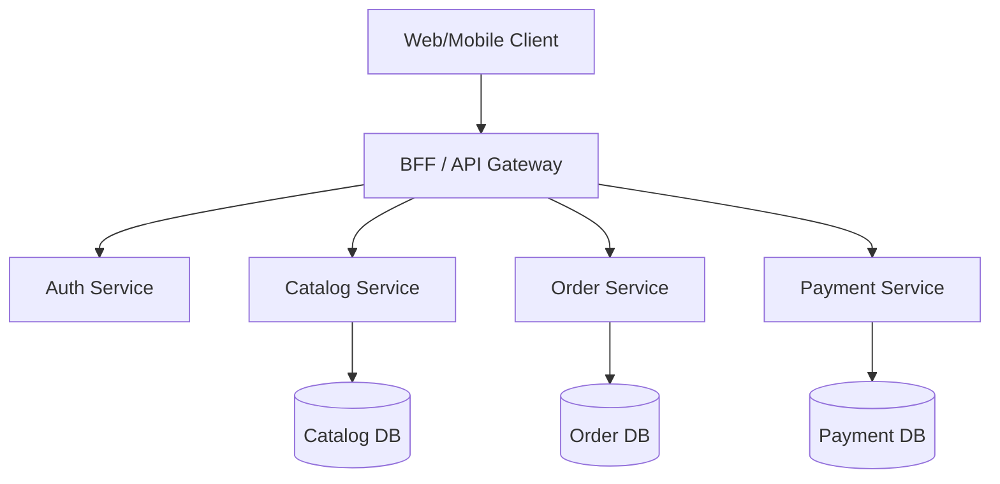

### 2.2 Sequence Diagram (Checkout)
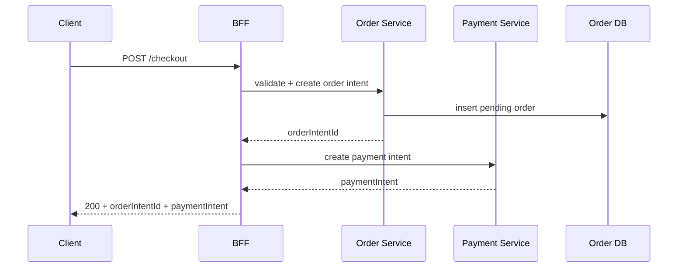

### 2.3 Use When
- Multiple clients need tailored API payloads
- You want to keep domain services client-agnostic

### 2.4 Risks
- BFF can become a monolith if business logic leaks into it

---

## 3. Pattern: Event-Driven Async Side Effects

### 3.1 Component Diagram
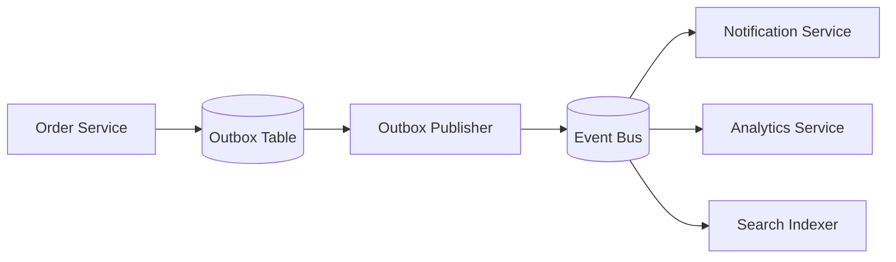

### 3.2 Sequence Diagram (Order Created)
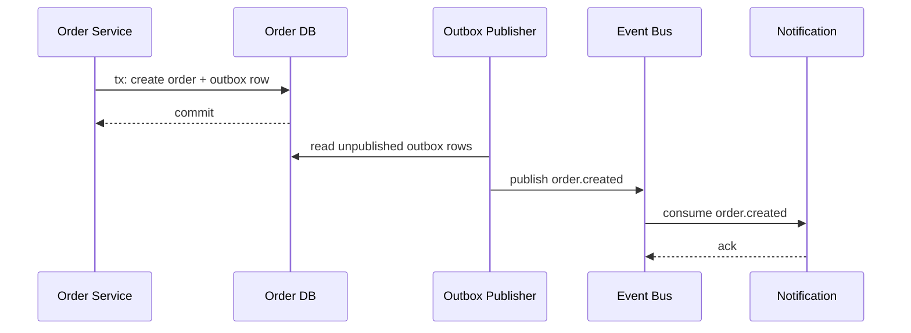

### 3.3 Use When
- Side effects should not block critical path
- Reliability of event publishing matters

### 3.4 Risks
- Consumer idempotency must be enforced
- Outbox lag must be monitored

---

## 4. Pattern: Saga for Distributed Transactions

### 4.1 Component Diagram
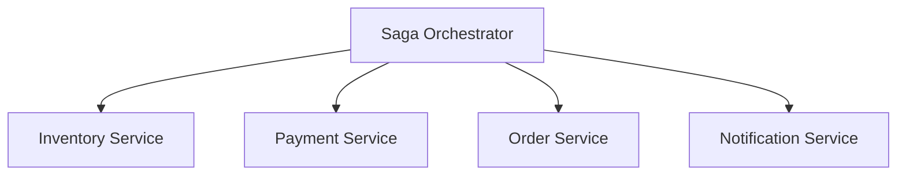

### 4.2 Sequence Diagram (Happy + Compensation)
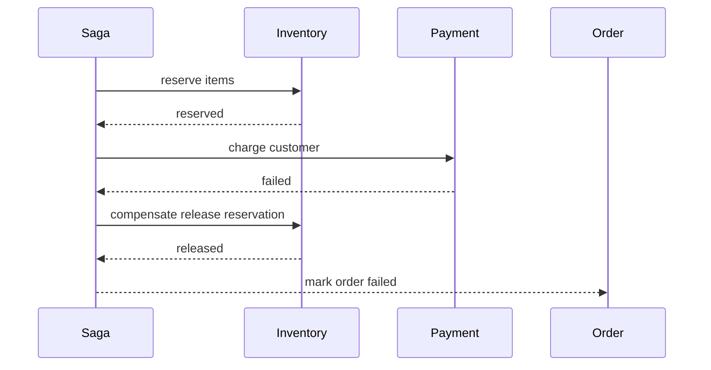

### 4.3 Use When
- Business transaction spans multiple services

### 4.4 Risks
- Complex state transitions and compensation logic

---

## 5. Pattern: CQRS Read/Write Separation

### 5.1 Component Diagram
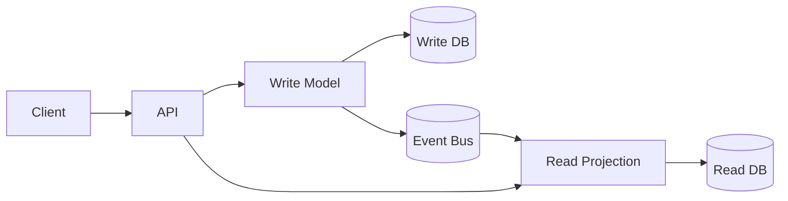

### 5.2 Sequence Diagram
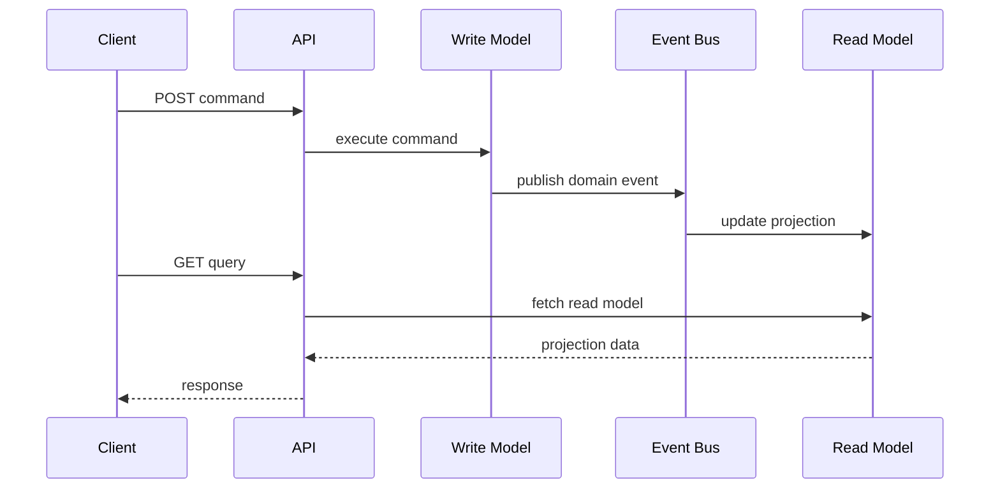

### 5.3 Use When
- Read and write workload patterns differ significantly

### 5.4 Risks
- Eventual consistency between write and read views

---

## 6. Pattern: Multi-Tenant SaaS Isolation

### 6.1 Component Diagram
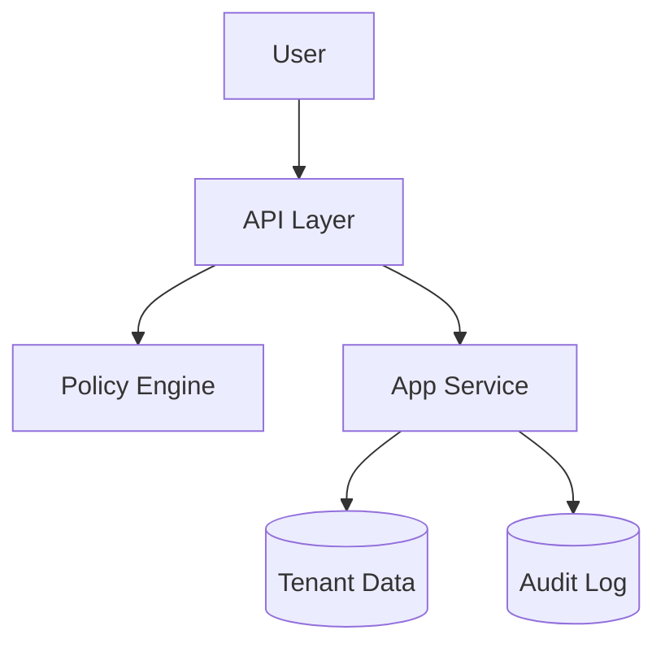

### 6.2 Sequence Diagram (Tenant-scoped Access)
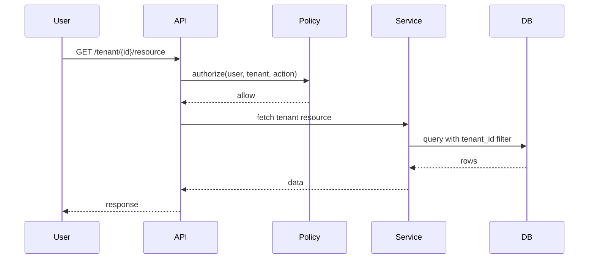

### 6.3 Use When
- B2B product with strict tenant isolation requirements

### 6.4 Risks
- Missing tenant filter can cause cross-tenant leaks

---

## 7. Pattern: Cache-Aside with Invalidation

### 7.1 Component Diagram
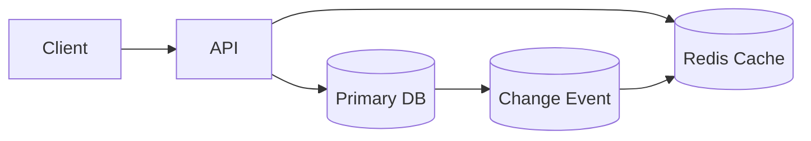

### 7.2 Sequence Diagram
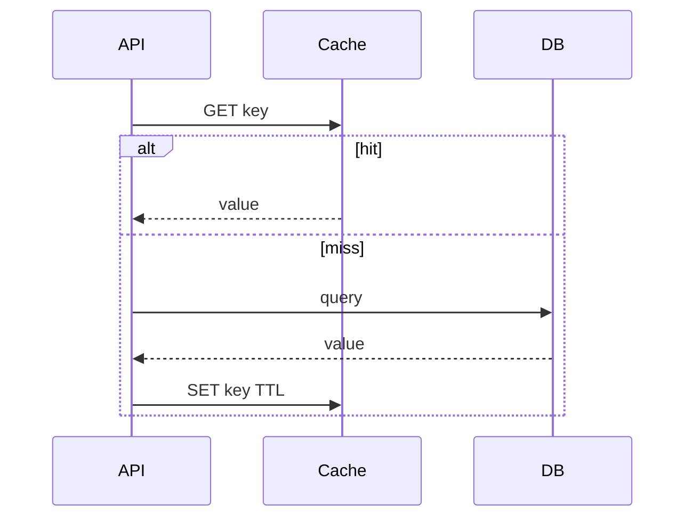

### 7.3 Use When
- Read-heavy paths with tolerable staleness windows

### 7.4 Risks
- Stale data if invalidation is weak

---

## 8. Pattern: Realtime Updates via WebSocket + Event Bus

### 8.1 Component Diagram
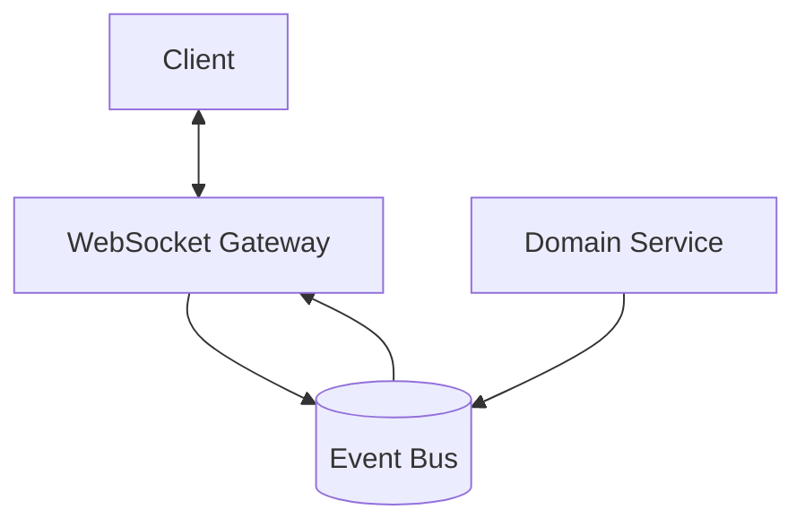

### 8.2 Sequence Diagram
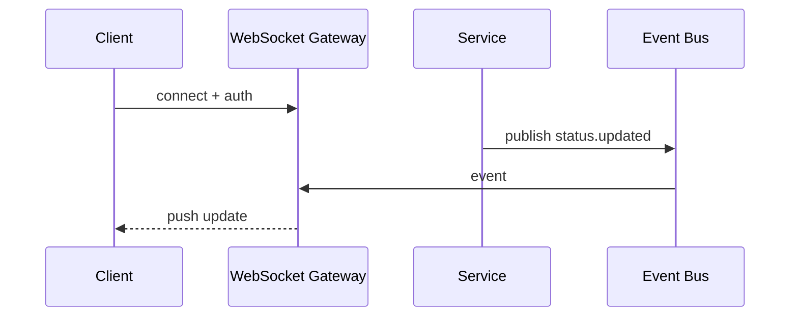

### 8.3 Use When
- Live tracking/chat/collaboration is required

### 8.4 Risks
- Connection state scaling, reconnect storms, and backpressure

---

## 9. Pattern: Fullstack AuthN/AuthZ

### 9.1 Component Diagram
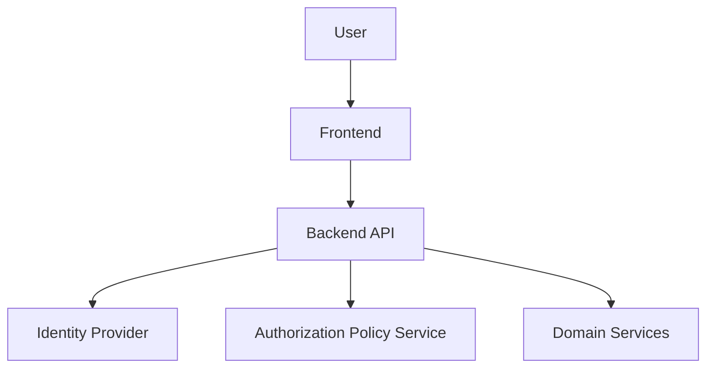

### 9.2 Sequence Diagram
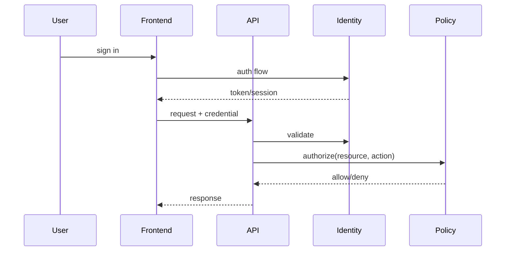

### 9.3 Use When
- Fine-grained access and strong auditing are required

### 9.4 Risks
- Frontend-only auth checks are insufficient

---

## 10. Pattern: Observability-Centered Operations

### 10.1 Component Diagram
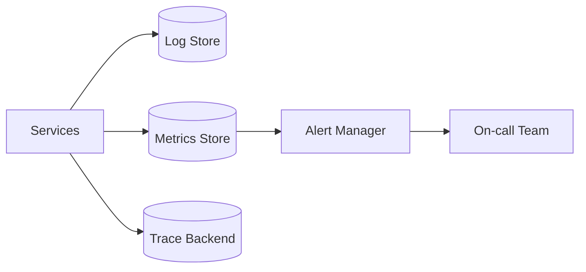

### 10.2 Sequence Diagram (Incident)
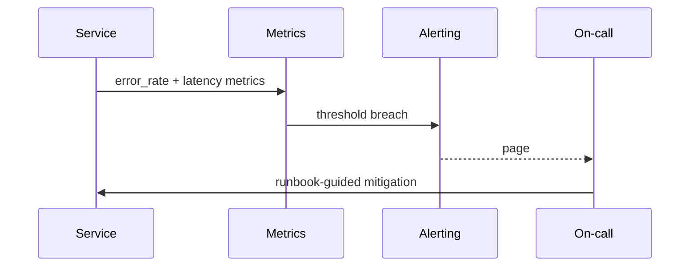

### 10.3 Use When
- Production reliability and fast MTTR are priorities

### 10.4 Risks
- Noisy alerts and poor runbooks increase downtime

---

## 11. Pattern: Blue/Green + Feature Flags

### 11.1 Component Diagram
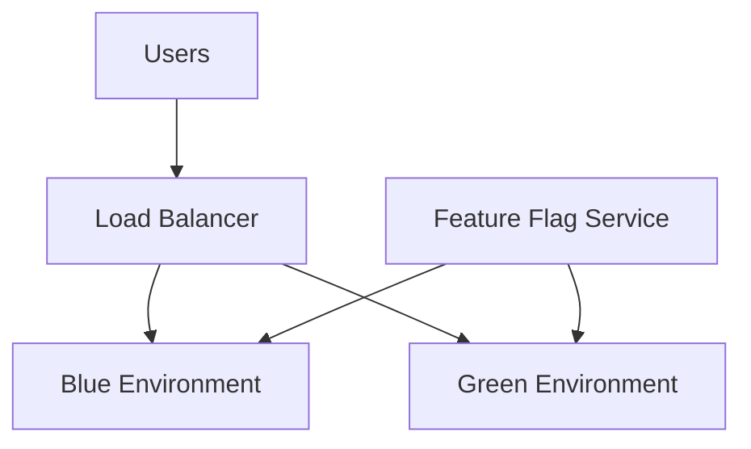

### 11.2 Sequence Diagram
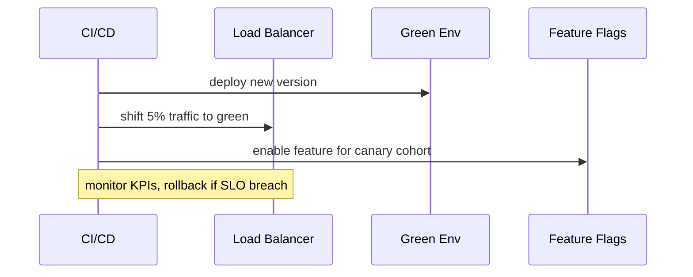

### 11.3 Use When
- You need low-risk production rollout

### 11.4 Risks
- Flag sprawl and unclear ownership

---

## 12. Pattern Mapping by Domain

### E-commerce
- BFF + domain services
- Saga for checkout
- Cache-aside for catalog
- Event-driven notifications

### SaaS
- Multi-tenant isolation
- Centralized policy service
- Audit trail architecture

### Fintech
- Saga + outbox + strong ledger consistency
- Idempotent money intents
- Strict observability and reconciliation

### Social
- Realtime WebSocket updates
- Event-driven fanout
- Hybrid consistency and hot-key cache controls

---

## 13. Diagram Review Checklist

- Do component boundaries align with ownership?
- Are critical flows represented with failure paths?
- Are state transitions explicit for write operations?
- Are consistency assumptions documented?
- Are security checks shown at boundaries?
- Are observability hooks represented?
- Is rollback path explicit in rollout diagrams?

---

## 14. Final Notes
A diagram is useful only if it captures:
- ownership,
- contracts,
- state transitions,
- and failure behavior.

Keep diagrams versioned with ADRs and update them whenever architecture changes materially.
